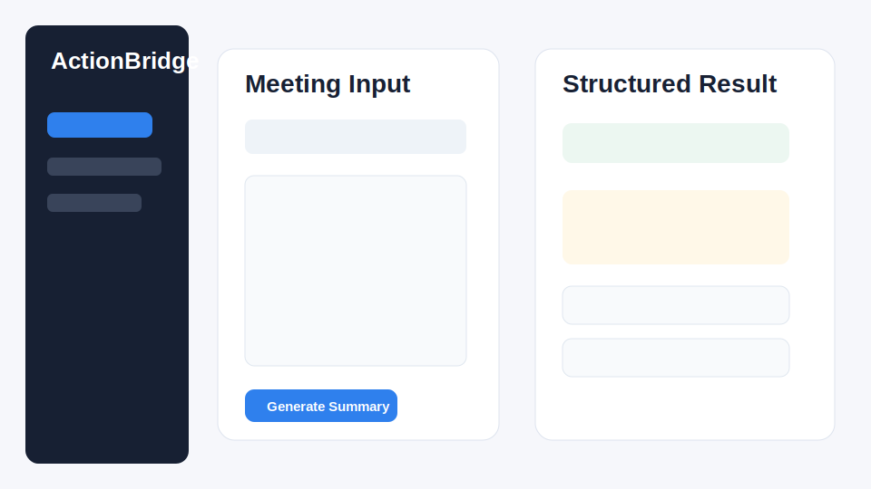
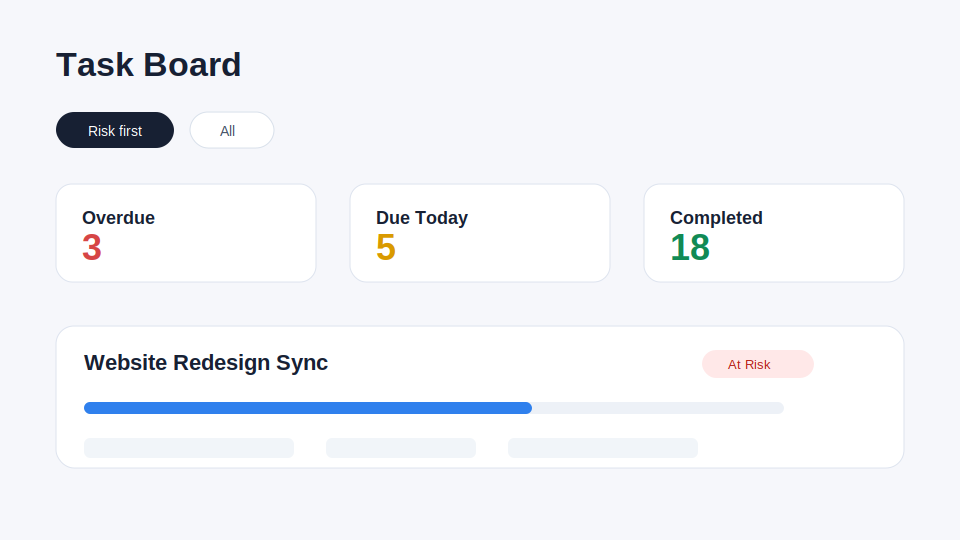
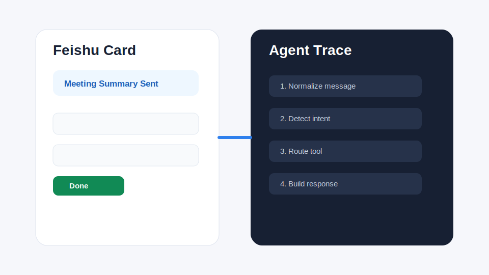
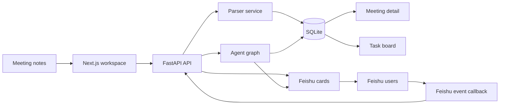

# ActionBridge

ActionBridge is a meeting-to-execution workspace. It turns meeting notes into structured summaries, decisions, and action items, then helps teams follow up through a web dashboard, Feishu cards, reminders, and a lightweight Agent.

> Current stage: MVP / demo-ready prototype

## Preview

Screenshots can be added under `docs/assets/`:

| Meeting Workspace | Task Board | Feishu / Agent |
| --- | --- | --- |
|  |  |  |

## What It Does

- Parses meeting transcripts into summaries, decisions, and action items.
- Tracks action item owner, deadline, deadline risk, and status.
- Groups tasks by meeting and highlights overdue or due-today work.
- Sends meeting summaries and task cards to Feishu.
- Supports Feishu fixed commands such as `/meeting`, `/tasks`, `/task`, `/done`, `/help`.
- Supports natural-language Agent actions such as querying tasks, creating tasks, changing owners, changing deadlines, and summarizing project progress.
- Records Agent traces so intent detection, tool routing, and responses can be debugged from the web UI.

## How It Works



## Tech Stack

| Layer | Tech |
| --- | --- |
| Frontend | Next.js 14, React, TypeScript |
| Backend | FastAPI, SQLAlchemy |
| Database | SQLite |
| AI parsing | DeepSeek / OpenAI-compatible API, rule fallback |
| Agent | LangGraph-style flow, local tool registry |
| Integration | Feishu event callback, Feishu Webhook / App Bot |

## Quick Start

Backend:

```bash
cd backend
pip install -r requirements.txt
uvicorn app.main:app --reload
```

Frontend:

```bash
cd frontend
npm install
npm run dev
```

Open:

```text
http://localhost:3000
```

API docs:

```text
http://localhost:8000/docs
```

## Feishu Bot

For Feishu event subscription, configure the request URL:

```text
https://your-public-domain/api/feishu/events
```

For local development, expose the backend with ngrok, cpolar, or another tunneling tool.

Common commands:

```text
/meeting <title>
meeting transcript...

/tasks
/task 12
/done 12
/help
/remember website = website redesign
/bind-channel website redesign
```

Natural-language examples:

```text
Show today's due tasks
Change task 12 to completed
Create a task: Alex tomorrow afternoon finish QA checklist
Summarize website redesign progress
```

## Documentation

- [Architecture](docs/architecture.md)
- [Feishu Flow](docs/feishu-flow.md)
- [Local Development](docs/local-dev.md)
- [Demo Script](docs/demo-script.md)
- [Original Design Spec](docs/superpowers/specs/2026-05-28-actionbridge-design.md)

## Test

Backend:

```bash
python -m pytest backend/tests
```

Frontend:

```bash
cd frontend
npm run build
```

## Current Scope

ActionBridge is designed as an MVP for demonstrating a practical meeting execution loop:

```text
meeting notes -> action items -> task tracking -> Feishu follow-up -> Agent-assisted updates
```

It is not yet a full enterprise workflow product. Obvious next steps include permission control, PostgreSQL migration, stronger notification policies, richer Feishu cards, and more external tool adapters.
