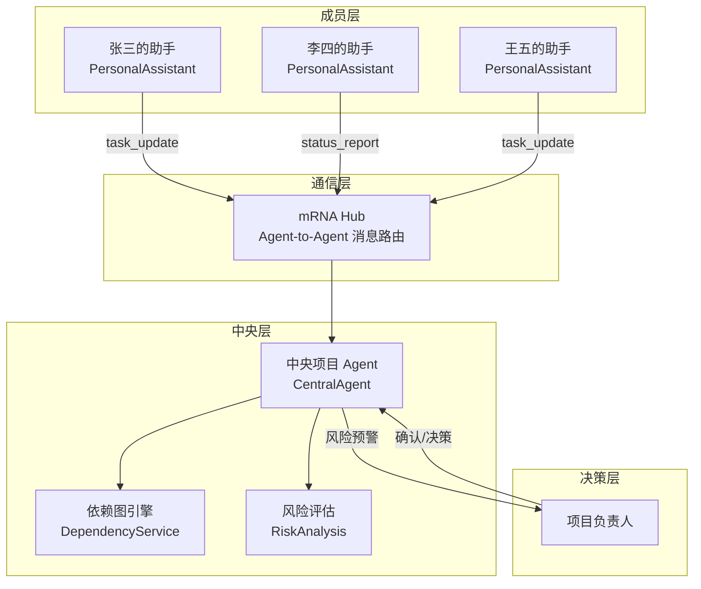
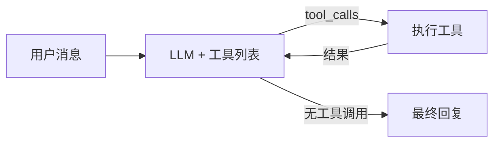
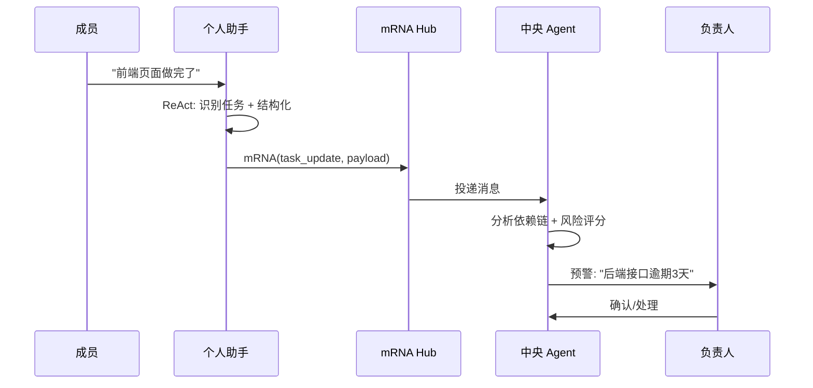

# ActionBridge — 基于 A2A 架构的多 Agent 项目管理系统

> 让 AI 监控项目进度，人做最终决策。不是又一个 TODO List——每一个成员都有私有 AI 助手，中央 Agent 持有项目依赖图，自动发现风险并预警。

## 解决的问题

项目管理里最古老的两个问题：**信息不对称**（"他到底做完了没有"）和**进度黑洞**（"这个任务卡了三天没人知道"）。

Jira/Trello 是人去更新看板。飞书 AI 是你去问它。ActionBridge 是 **AI 主动告诉你**："张三的任务逾期 3 天了，下游李四和王五的截止时间因此有风险，建议你找张三确认。"

## 与现有工具的差异

| | Jira / Trello | 飞书 AI | OpenClaw | ActionBridge |
|---|---|---|---|---|
| 定位 | 看板工具 | 通用 AI 助手 | 通用 Agent 平台 | 垂直项目 Agent |
| 交互方式 | 人填写表单 | 人提问，AI 回答 | 配置 Agent 行为 | 聊天即更新，AI 主动预警 |
| 多 Agent | 无 | 无 | 支持多 Agent | A2A hub-and-spoke |
| 进度监控 | 人主动更新 | 被动查询 | 需自行配置 | AI 定时扫描 + 主动推送 |
| 安全边界 | 权限系统 | 无写操作 | 审批工作流 | 确认门控 |

## 项目完成度

```
████████░░  85%
```

| 模块 | 状态 | 说明 |
|------|------|------|
| Agent 内核 | ✅ | ReAct Loop + 10 工具 + LLM Function Calling |
| A2A 架构 | ✅ | mRNA 协议 + 个人助手 + 中央 Agent |
| 飞书集成 | ✅ | 私聊识别 + 主动回复 + 群消息 |
| 确认门控 | ✅ | 写操作二次确认机制 |
| Trace 可观测 | ✅ | ReAct 决策链可视化面板 |
| 评估体系 | ✅ | 20 标注用例 + 跑分脚本 |
| 依赖图引擎 | ✅ | 关键路径 + 下游影响 + 风险评分 |
| 双驱动模型 | ✅ | 事件驱动（消息触发）+ 定时驱动（每日扫描） |
| Web Demo | ✅ | A2A 多 Agent 协作模拟页面 |
| 测试 | ✅ | 131 pass / 21 skip / 0 fail |
| 部署上线 | ⏳ | 待部署到 Railway + Vercel |
| 多项目管理 | ⏳ | 当前 MVP 单项目 |

## 应用场景

**跨团队项目**：前端等后端接口，后端等数据迁移——群聊消息被淹没，Agent 追踪依赖链上的状态传递。

**乙方/外包管理**：甲方不在工作群里，Agent 提供外部视角的项目透明面板。

**新人多的团队**：Agent 的成员面板告诉你谁负责什么、谁在摸鱼，降低管理认知负担。

## 使用方式

| 谁 | 用什么 | 做什么 |
|----|--------|--------|
| 团队成员 | 飞书私聊 Bot | "XX做完了""XX卡住了"——像聊天一样汇报进度 |
| 项目负责人 | Web 仪表盘 | 看成员完成率、风险预警、项目全局状态 |
| 开发者 | Agent 调试面板 | 回放 ReAct 决策链，跑评估看准确率 |
| 面试官 | A2A Demo 页 | 模拟多人协作，观察 Agent 间 mRNA 通信 |

不需要注册登录。身份靠飞书 `open_id` 自动识别。成员不需要打开网页。

## 面试演示指南

**Demo 流程**（5 分钟展示核心技术能力）：

1. 打开 `/demo` → 注册成员 → 选三个角色依次发送进度更新
2. 右侧 mRNA 消息流实时展示 Agent 间通信
3. 底部负责人面板自动刷新：完成率变化 + 风险预警
4. 打开 `/agent-debug` → 输入"分析项目风险" → 展示 ReAct 两步工具链
5. 打开 `/meetings/new` → 粘贴会议记录 → AI 解析出行动项

**技术点**（引导面试官追问）：

- "Agent 怎么选择工具？" → ReAct + Function Calling，LLM 自主决策
- "多个 Agent 怎么通信？" → 自研 mRNA 协议，hub-and-spoke 架构
- "写操作安全吗？" → 确认门控，危险操作需要用户二次确认
- "怎么评估 Agent 质量？" → 20 例标注数据集，改前后准确率对比

## 架构

```
┌─────────┐  ┌─────────┐  ┌─────────┐
│张三的助手│  │李四的助手│  │王五的助手│  ← 个人 AI 助手（飞书私聊）
└────┬─────┘  └────┬─────┘  └────┬─────┘
     │ mRNA 协议    │              │
     └──────────────┼──────────────┘
                    ▼
           ┌────────────────┐
           │  中央项目 Agent  │  ← 持有项目计划 + 依赖图
           └───────┬────────┘
                   │ 风险预警
                   ▼
           ┌────────────────┐
           │   项目负责人     │  ← 人做最终决策
           └────────────────┘
```

### 核心设计

- **A2A（Agent-to-Agent）通信**：自研 mRNA 协议——个人助手把成员进度转成结构化消息传递给中央 Agent。同一进程空间内通信，MVP 不需要微服务
- **ReAct Agent 循环**：LLM 自主选择工具链（Thought → Tool Call → Result → 再思考），替代传统的意图分类器 + 硬编码路由
- **确认门控**：写操作（创建任务、改负责人、改截止时间）需要用户二次确认才能执行——AI 做分析和建议，人做最终决策
- **Agent Trace 可观测**：每一步决策链（选了哪个工具、传了什么参数、结果是什么）全程记录，Web 面板可回放
- **评估体系**：20 例标注数据集，每次改 Agent 逻辑后跑分对比准确率

### 消息通道

Agent 内核与消息通道通过 `MessageDeliveryPort` 接口解耦。当前已接入飞书（个人助手走**私聊**，中央预警走**群消息**），架构上预留了钉钉/企微/Slack 的扩展点。

## 架构图

### A2A 多 Agent 协作



### ReAct Agent 循环



### mRNA 通信协议



## 技术栈

| 层 | 技术 | 说明 |
|---|------|------|
| Agent 核心 | Python, ReAct Loop, LLM Function Calling | LLM 自主选择工具，非意图分类 |
| Backend | FastAPI, SQLAlchemy, SQLite | 异步就绪，SQLite → PostgreSQL 迁移成本低 |
| Frontend | Next.js 14, React, TypeScript | Agent 可观测面板为核心页面 |
| LLM | DeepSeek (OpenAI-compatible) | 可切换 OpenAI / 其他兼容 API |
| 消息通道 | 飞书 Bot API | MessageDeliveryPort 接口解耦，可扩展 |
| 通信协议 | mRNA (Message Relay for Networked Agents) | 自研 A2A 数据协议 |

## 项目结构

```
backend/
├── app/
│   ├── agent/
│   │   ├── graph.py              # ReAct 循环核心
│   │   ├── tools.py              # 10 个 Agent 工具（查询/分析/写操作）
│   │   ├── tool_contracts.py     # AgentTool + JSON Schema 定义
│   │   ├── tool_registry.py      # 工具注册表（支持 to_openai_tools()）
│   │   ├── mrna_protocol.py      # A2A 通信协议 + mRNAHub
│   │   ├── personal_assistant.py # 个人 AI 助手（私聊）
│   │   ├── central_agent.py      # 中央项目 Agent（风险分析）
│   │   ├── orchestrator.py       # 飞书消息编排
│   │   └── schemas.py            # 数据结构定义
│   ├── models/                   # ORM 模型（Project/Member/Alert 等）
│   ├── services/                 # 业务服务层
│   │   ├── dependency_service.py # 依赖图计算（关键路径/下游影响/风险评分）
│   │   └── plan_service.py       # 项目计划 CRUD + 健康分析
│   ├── api/routes.py             # FastAPI 路由
│   └── db/                       # 数据库（SQLAlchemy + 轻量迁移）
├── tests/
│   ├── agent_eval/               # Agent 评估数据集 + 跑分脚本
│   │   ├── eval_cases.json       # 20 例标注用例
│   │   └── eval_runner.py        # 评估脚本
│   └── test_*.py                 # 单元测试
frontend/
├── app/
│   ├── page.tsx                  # 首页（项目列表）
│   ├── agent-debug/page.tsx      # Agent 调试面板（核心页面）
│   ├── tasks/page.tsx            # 任务看板
│   └── projects/[id]/page.tsx    # 项目健康仪表盘
├── components/
│   └── AgentDebugPanel.tsx       # ReAct 步骤链可视化
└── lib/
    ├── types.ts                  # 前端类型定义（与后端 Pydantic 同步）
    └── api.ts                    # API 调用封装
```

## 快速开始

### 1. 环境配置

```bash
cp .env.example .env
# 编辑 .env，填入 DeepSeek API Key（必填，其他可选）
# DEEPSEEK_API_KEY=sk-你的key
```

### 2. 后端

```bash
cd backend
python3 -m venv .venv
source .venv/bin/activate
pip install -r requirements.txt
uvicorn app.main:app --reload
```

API 文档：`http://localhost:8000/docs`

### 3. 前端

```bash
cd frontend
npm install
npm run dev
```

打开：`http://localhost:3000`

### 4. Agent 调试

访问 `http://localhost:3000/agent-debug`，输入消息查看 ReAct 决策链。

### 5. 跑评估

```bash
cd backend
python tests/agent_eval/eval_runner.py --verbose
```

输出示例：

```
Agent Evaluation Report
==================================================
Total cases:       20
Tool accuracy:     85.0% (17/20)
Arg accuracy:      75.0% (15/20)

By category:
  query      ████████░░ 80.0% (8/10)
  write      █████████░ 87.5% (7/8)
  report     ██████████ 100.0% (2/2)
```

## Agent 工具列表

| 工具 | 类型 | 说明 |
|------|------|------|
| `query_tasks` | 读 | 按状态/负责人/关键词/到期状态查询任务 |
| `query_member_activity` | 读 | 查询成员活跃度：更新频率、完成率 |
| `summarize_project` | 读 | 项目进度汇总：完成率、各状态分布 |
| `analyze_risk` | 读 | 风险评估：逾期/阻塞/依赖链影响扫描 |
| `generate_progress_report` | 读 | 综合进度报告（合并风险 + 成员分析） |
| `update_task_status` | 写 | 更新任务状态（可直接执行） |
| `create_task` | 写 | 创建任务（需用户确认） |
| `update_task_deadline` | 写 | 修改截止时间（需用户确认） |
| `update_task_owner` | 写 | 修改负责人（需用户确认） |
| `create_alert` | 写 | 创建项目预警 |

## 飞书 Bot 配置（可选）

飞书开放平台 → 创建应用 → 事件订阅 → 配置请求 URL：

```text
https://your-domain/api/feishu/events
```

本地开发用 ngrok/cpolar 暴露后端。常见命令：

```text
/help                    查看帮助
/tasks                   查看未完成任务
/task 12                 查看 12 号任务详情
/done 12                 标记 12 号任务完成
/remember 官网=官网改版    设置别名

# 自然语言（走 Agent）
"今天到期的任务有哪些"
"官网改版项目进度怎么样"
"把 12 号任务负责人改成测试同学"
"分析项目风险"
```

## 测试

```bash
# 后端
python -m pytest backend/tests -v

# 前端
cd frontend && npm run build
```

## 设计参考

- [Architecture](docs/architecture.md) — 多 Agent 架构文档
- [Feishu Flow](docs/feishu-flow.md) — 飞书集成流程
- [Local Development](docs/local-dev.md) — 本地开发指南

## License

MIT
