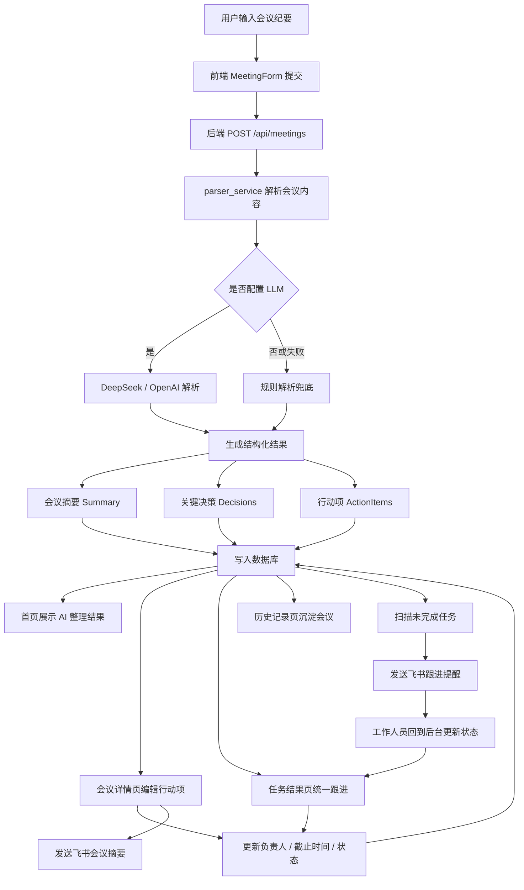
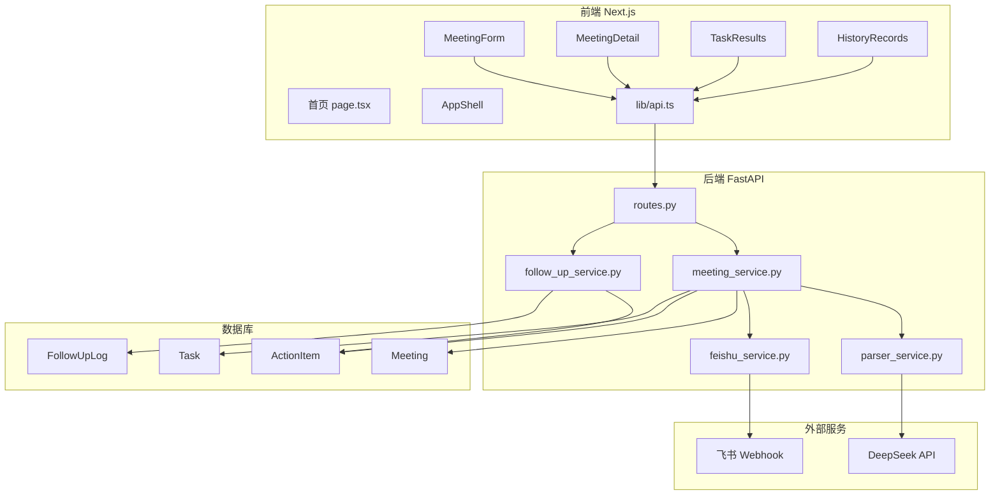

# ActionBridge

ActionBridge 是一个“会议纪要到执行闭环”的办公协作 Agent MVP。它把会议文本解析成结构化摘要、关键决策和行动项，并通过任务结果页、历史记录页、飞书通知和自动跟进提醒，把会议后的执行过程持续推进下去。

## 项目定位

这个项目不是单纯的 AI 聊天 Demo，而是面向研发、产品、测试等团队的会议执行工具：

1. 降低会议后手动整理纪要和拆任务的成本。
2. 把行动项沉淀到系统中，方便统一跟踪负责人、截止时间和状态。
3. 通过飞书机器人推送摘要和跟进提醒，减少任务遗漏。
4. 通过历史记录页面沉淀会议处理结果，形成可回溯的执行闭环。

## 功能闭环



## 页面能力

```text
/                      会议处理工作台
/meetings/[id]         会议详情页
/tasks                 任务结果页
/history               历史记录页
```

- 会议处理工作台：输入会议标题和会议记录，生成摘要、决策和行动项。
- 会议详情页：查看完整会议结果，编辑行动项负责人、截止时间和状态，并发送飞书摘要或跟进提醒。
- 任务结果页：集中查看所有行动项，支持按状态筛选、搜索、标记完成或设为待处理。
- 历史记录页：按会议维度沉淀记录，展示行动项数量、未完成数量和闭环状态。

## 代码结构

```text
ActionBridge/
  backend/
    app/
      api/
        routes.py              API 路由入口
      core/
        config.py              环境变量配置
        time.py                时间工具
      db/
        session.py             数据库连接
        base.py                模型注册
      models/
        meeting.py             会议模型
        action_item.py         行动项模型
        task.py                后台任务模型
        follow_up_log.py       跟进日志模型
      schemas/
        meeting.py             会议响应结构
        action_item.py         行动项更新结构
        task_result.py         任务结果结构
      services/
        parser_service.py      LLM / 规则解析会议纪要
        meeting_service.py     会议、行动项、飞书发送业务逻辑
        feishu_service.py      飞书卡片生成与发送
        follow_up_service.py   未完成任务扫描与提醒
    tests/                     后端自动化测试

  frontend/
    app/
      page.tsx                 首页会议处理
      tasks/page.tsx           任务结果页
      history/page.tsx         历史记录页
      meetings/[id]/page.tsx   会议详情页
      layout.tsx               全局布局入口
    components/
      AppShell.tsx             左侧导航 + 顶部导航
      MeetingForm.tsx          会议输入表单
      MeetingDetail.tsx        会议详情与行动项编辑
      TaskResults.tsx          任务结果页交互
      HistoryRecords.tsx       历史记录页交互
    lib/
      api.ts                   前端 API 请求
      types.ts                 TypeScript 类型
    styles/
      layout.css               框架导航样式
      workspace.css            首页工作台样式
      tasks.css                任务结果页样式
      history.css              历史记录页样式
      detail.css               会议详情页样式
```

## 模块关系



## 后端 API

```text
POST  /api/meetings                    创建会议并解析纪要
GET   /api/meetings                    获取历史会议列表
GET   /api/meetings/{meeting_id}       获取会议详情
GET   /api/action-items                获取全部行动项
PATCH /api/action-items/{id}           更新行动项负责人、截止时间、状态
POST  /api/meetings/{id}/send-feishu   发送飞书会议摘要
POST  /api/meetings/{id}/follow-up     发送当前会议跟进提醒
POST  /api/follow-ups/run              批量扫描未完成任务并提醒
POST  /api/feishu/card-callback        预留飞书卡片回调接口
```

## 技术栈

后端：

- Python
- FastAPI
- SQLAlchemy
- SQLite
- OpenAI Python SDK
- httpx
- pytest

前端：

- Next.js
- React
- TypeScript
- CSS Modules by responsibility，按页面和布局拆分普通 CSS 文件

外部服务：

- DeepSeek API
- OpenAI-compatible API
- 飞书自定义机器人 Webhook

## 环境变量

在项目根目录创建 `.env`，可以参考 `.env.example`。

```env
DEEPSEEK_API_KEY=your_real_deepseek_key
DEEPSEEK_MODEL=deepseek-chat
DEEPSEEK_BASE_URL=https://api.deepseek.com
ACTIONBRIDGE_PARSER_PROVIDER=deepseek

FEISHU_WEBHOOK_URL=your_real_feishu_webhook

ACTIONBRIDGE_AUTO_FOLLOW_UP_ENABLED=true
ACTIONBRIDGE_AUTO_FOLLOW_UP_HOUR=10
ACTIONBRIDGE_AUTO_FOLLOW_UP_MINUTE=0
ACTIONBRIDGE_AUTO_FOLLOW_UP_POLL_SECONDS=30
```

如果没有配置 LLM Key，系统会自动使用规则解析兜底，方便本地演示和测试。

## 启动后端

```bash
cd backend
pip install -r requirements.txt
uvicorn app.main:app --reload
```

后端地址：

```text
http://localhost:8000
```

Swagger 文档：

```text
http://localhost:8000/docs
```

## 启动前端

```bash
cd frontend
npm install
npm run dev
```

前端地址：

```text
http://localhost:3000
```

## 测试

后端测试：

```bash
cd backend
python -m pytest
```

前端构建：

```bash
cd frontend
npm run build
```

当前测试覆盖包括：

- 会议创建和查询
- LLM / 规则解析兜底
- 行动项更新
- 任务结果列表
- 历史记录统计
- 飞书卡片 payload
- 飞书提醒扫描
- 飞书回调预留接口

## 演示流程

1. 打开 `http://localhost:3000`。
2. 输入会议标题和会议记录。
3. 点击生成会议纪要。
4. 进入会议详情页，查看摘要、决策和行动项。
5. 编辑行动项负责人、截止时间和状态。
6. 点击发送飞书摘要，把会议结果推送到飞书群。
7. 进入 `/tasks`，在任务结果页统一跟进所有行动项。
8. 将任务标记为完成后，进入 `/history` 查看会议闭环状态。
9. 运行批量跟进接口或开启自动跟进，让机器人提醒未完成任务。

## 当前能力总结

- 已实现会议纪要结构化解析。
- 已实现行动项负责人、截止时间、状态管理。
- 已实现任务结果页和历史记录页。
- 已实现飞书会议摘要卡片和跟进提醒卡片。
- 已实现自动扫描未完成任务。
- 已保留飞书卡片回调接口，方便后续升级为飞书内交互。

## 后续规划

- 增加负责人筛选和日期筛选。
- 增加逾期任务识别和优先级排序。
- 将右侧 AI 助手升级为可对当前会议进行对话式修改。
- 引入 Memory，记录团队成员、常见项目、历史任务偏好。
- 接入 MCP，让 Agent 可以读取更多办公系统上下文。
- 从 SQLite 升级到 PostgreSQL，并加入任务队列处理异步解析和提醒。

## 简历描述参考

ActionBridge 是一个会议执行闭环 Agent MVP，基于 FastAPI、Next.js、LLM 解析和飞书机器人集成，实现会议纪要结构化、行动项生成、任务状态跟进、历史记录沉淀和自动提醒，帮助团队降低会议后整理与跟进成本。
