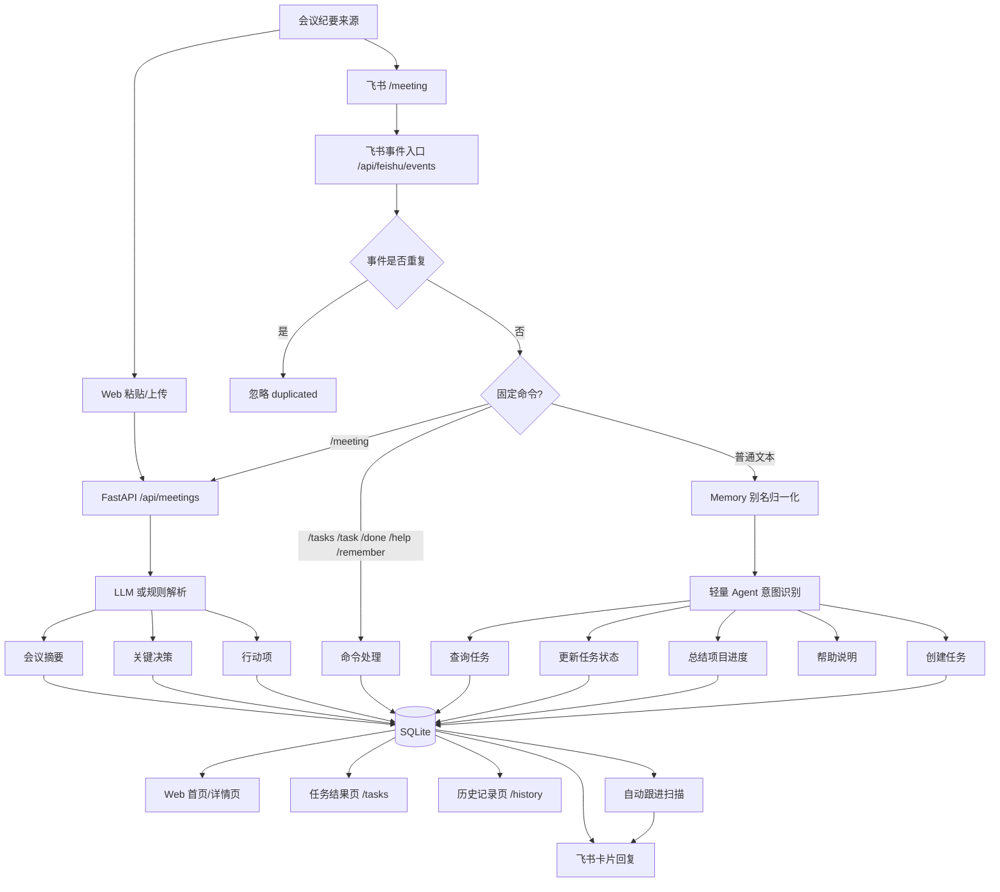
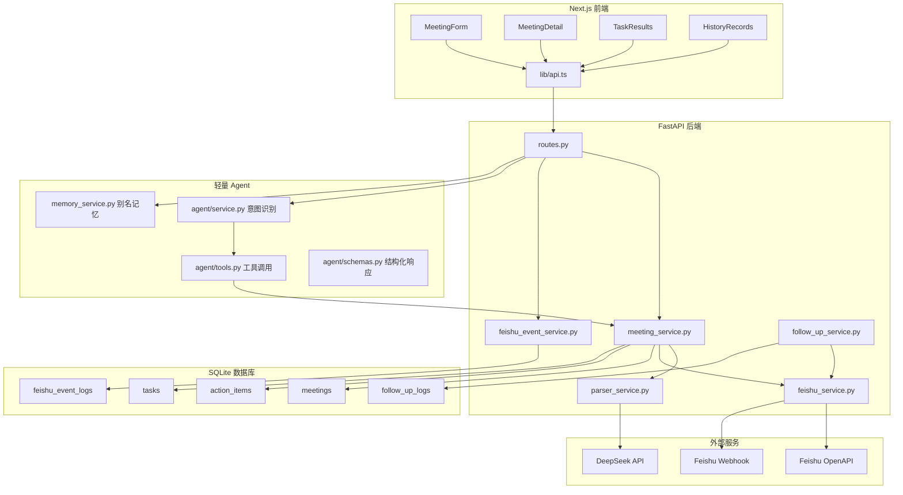

# ActionBridge

ActionBridge 是一个“会议纪要到执行闭环”的办公协作 Agent MVP。它可以把会议文本解析成结构化摘要、关键决策和行动项，并通过 Web 工作台、任务看板、历史归档、飞书机器人和轻量 Agent 能力，持续推进会议后的执行过程。

## 项目定位

这个项目不是单纯的 AI 聊天 Demo，而是面向研发、产品、测试、运营等团队的会议执行工具：

- 降低会议后手动整理纪要、拆任务和跟进状态的成本。
- 将行动项沉淀到系统中，统一管理负责人、截止时间和任务状态。
- 通过飞书机器人接收会议纪要、查询任务、更新任务、总结项目进度。
- 通过任务结果页和历史记录页形成可追踪、可回溯的执行闭环。

## 核心功能

- 会议纪要输入：支持 Web 粘贴文本和上传 `.txt`、`.md`、`.vtt`、`.srt` 文本文件。
- LLM 解析：调用 DeepSeek/OpenAI-compatible API 生成摘要、决策和行动项。
- 规则兜底：未配置 LLM 或调用失败时，使用规则解析保证本地演示可用。
- 行动项管理：支持编辑负责人、截止日期、截止时间和任务状态。
- 任务结果页：按会议分组展示任务，支持状态筛选、搜索、进度条和风险优先。
- 历史记录页：展示会议归档、整体执行情况和完成率环形图。
- 飞书机器人：支持 Webhook 机器人和自建应用机器人。
- 飞书上下文回复：私聊触发回复私聊，群聊触发回复原群，后台发送和自动提醒发送默认群。
- 轻量 Agent：支持自然语言创建任务、查询任务、更新任务状态、总结项目进度和查看帮助。
- 结构化 Memory：支持项目别名、成员别名和团队术语映射，让 Agent 能理解团队内部说法。
- 自动跟进：支持扫描未完成任务，并发送飞书跟进提醒。
- 事件去重：基于飞书 `event_id/message_id` 做数据库级幂等去重，避免重复回调导致重复创建或重复发送。

## 功能流程



## 页面说明

```text
/                    会议处理工作台
/meetings/[id]       会议详情与行动项编辑
/tasks               任务结果页 / 执行看板
/history             历史记录页 / 归档统计
```

- 会议处理工作台：输入会议标题和会议记录，生成摘要、决策和行动项。
- 会议详情页：查看完整会议结果，编辑行动项负责人、截止时间和状态。
- 任务结果页：按会议分组管理所有行动项，判断每个会议/项目的执行进度。
- 历史记录页：沉淀会议归档，展示整体执行情况、完成率和风险数量。

## 技术架构



## 代码结构

```text
ActionBridge/
  backend/
    app/
      agent/
        service.py                   轻量 Agent 意图识别与编排
        tools.py                     任务查询、状态更新、项目总结工具
        schemas.py                   AgentIntent / AgentResponse / 进度总结结构
      api/routes.py                  API 路由入口
      core/config.py                 环境变量配置
      core/time.py                   时间工具
      db/session.py                  数据库连接
      db/base.py                     模型注册
      db/migrations.py               SQLite 轻量迁移
      models/                        SQLAlchemy 数据模型
      schemas/                       请求/响应结构
      services/parser_service.py     LLM/规则解析会议纪要
      services/meeting_service.py    会议、行动项、飞书发送业务逻辑
      services/feishu_event_service.py 飞书消息事件解析
      services/feishu_service.py     飞书卡片生成与发送
      services/memory_service.py     结构化 Memory 别名管理
      services/follow_up_service.py  未完成任务扫描与提醒
    tests/                           后端自动化测试
  frontend/
    app/page.tsx                     首页会议处理
    app/tasks/page.tsx               任务结果页
    app/history/page.tsx             历史记录页
    app/meetings/[id]/page.tsx       会议详情页
    components/                      页面组件
    lib/api.ts                       前端 API 请求
    lib/types.ts                     TypeScript 类型
    styles/                          页面样式
```

## 后端 API

```text
POST  /api/meetings                    创建会议并解析纪要
GET   /api/meetings                    获取历史会议列表
GET   /api/meetings/{meeting_id}       获取会议详情
GET   /api/action-items                获取全部行动项
PATCH /api/action-items/{id}           更新行动项负责人、截止时间、状态
POST  /api/meetings/{id}/send-feishu   发送飞书会议摘要
POST  /api/meetings/{id}/follow-up     发送当前会议跟进提醒
POST  /api/follow-ups/run              批量扫描未完成任务并提醒
POST  /api/feishu/events               飞书消息事件入口
POST  /api/feishu/card-callback        预留飞书卡片回调入口
```

## 飞书机器人使用

### 1. 事件订阅地址

本地开发需要先用 ngrok、cpolar 等工具把后端暴露到公网。

飞书事件订阅 Request URL：

```text
https://你的公网域名/api/feishu/events
```

飞书第一次校验时会发送 `challenge`，后端会原样返回。

### 2. 固定命令

```text
/help
```

查看 ActionBridge 使用帮助。

```text
/meeting 会议标题
会议正文...
```

创建会议，调用 LLM/规则解析会议纪要，并回复会议摘要卡片。

```text
/tasks
```

查询当前未完成任务列表。

```text
/task 12
```

查询任务 ID 为 12 的单个任务详情。

```text
/done 12
```

把任务 ID 为 12 的行动项标记为已完成。

```text
/remember 官网 = 官网改版
/remember project 官网 = 官网改版
/remember 张三 = 前端同学
```

记住团队内部别名。之后用户说“官网进度怎么样”，Agent 会先归一化为“官网改版进度怎么样”。

```text
/memory
```

查看当前已记住的别名。

```text
/forget 官网
```

删除一条别名记忆。

### 3. 自然语言 Agent 示例

任务查询：

```text
帮我看看今天到期的任务
逾期任务有哪些
前端同学负责的任务
官网改版相关任务
```

任务状态更新：

```text
把 12 号任务标记完成
12 号任务已完成
把 8 号任务改成进行中
9 号任务有风险
把 6 号任务改回待处理
```

任务创建：

```text
帮我加一个任务，前端同学周五前完成登录页联调
创建任务：设计同学 明天下午 产出首页 banner 图
新增行动项：产品经理 周三前 确认上线公告文案
```

如果缺少负责人或截止时间，机器人会先回复补充提示，不会直接创建任务。

项目进度总结：

```text
官网改版进度怎么样
官网改版有哪些风险
总结一下官网改版项目
```

帮助：

```text
帮助
你能做什么
怎么使用
```

Memory 示例：

```text
/remember 官网 = 官网改版
官网进度怎么样
```

### 4. 回复范围

```text
飞书私聊触发：回复私聊
飞书群聊触发：回复原群
Web 后台点击发送：发送默认群
自动跟进提醒：发送默认群
```

### 5. 飞书发送方式

系统优先使用自建应用机器人发送卡片：

```env
FEISHU_APP_ID=cli_xxx
FEISHU_APP_SECRET=your_feishu_app_secret
FEISHU_DEFAULT_CHAT_ID=oc_xxx
```

如果没有配置自建应用机器人，则回退到 Webhook 机器人：

```env
FEISHU_WEBHOOK_URL=https://open.feishu.cn/open-apis/bot/v2/hook/your-webhook-id
```

## 环境变量

在项目根目录创建 `.env`，可参考 `.env.example`。

```env
DEEPSEEK_API_KEY=your_deepseek_api_key
DEEPSEEK_MODEL=deepseek-chat
DEEPSEEK_BASE_URL=https://api.deepseek.com
ACTIONBRIDGE_PARSER_PROVIDER=deepseek

FEISHU_WEBHOOK_URL=https://open.feishu.cn/open-apis/bot/v2/hook/your-webhook-id
FEISHU_APP_ID=cli_xxx
FEISHU_APP_SECRET=your_feishu_app_secret
FEISHU_DEFAULT_CHAT_ID=oc_xxx

ACTIONBRIDGE_AUTO_FOLLOW_UP_ENABLED=false
ACTIONBRIDGE_AUTO_FOLLOW_UP_HOUR=10
ACTIONBRIDGE_AUTO_FOLLOW_UP_MINUTE=0
ACTIONBRIDGE_AUTO_FOLLOW_UP_POLL_SECONDS=30
```

注意：`.env` 包含密钥，不能提交到 GitHub。

## 启动后端

```bash
cd backend
pip install -r requirements.txt
uvicorn app.main:app --reload
```

后端地址：

```text
http://localhost:8000
```

Swagger 文档：

```text
http://localhost:8000/docs
```

## 启动前端

```bash
cd frontend
npm install
npm run dev
```

前端地址：

```text
http://localhost:3000
```

## 测试

后端测试：

```bash
python -m pytest backend/tests
```

前端构建：

```bash
cd frontend
npm run build
```

当前测试覆盖：

- 会议创建和详情查询
- LLM/规则解析兜底
- 行动项更新
- 任务结果页 API
- 历史记录统计
- 截止日期与到期风险判断
- 飞书卡片 payload
- 飞书 `/meeting`、`/tasks`、`/task`、`/done`、`/help` 指令
- 飞书 `/remember`、`/memory`、`/forget` Memory 指令
- 飞书自然语言任务创建、任务查询、任务更新、项目进度总结
- Agent Memory 别名归一化
- 飞书事件数据库级幂等去重
- 自动跟进扫描

## 演示流程

1. 启动后端和前端。
2. 打开 `http://localhost:3000`，粘贴会议纪要或上传文本文件。
3. 点击“AI 生成会议纪要”，查看整理结果。
4. 进入会议详情页，编辑行动项负责人、截止日期、截止时间和状态。
5. 进入 `/tasks`，查看按会议分组的任务执行看板。
6. 进入 `/history`，查看会议归档、整体执行情况和完成率。
7. 在飞书中发送 `/help`，查看机器人能力说明。
8. 在飞书中发送 `/meeting` 消息，验证机器人自动创建会议并发布卡片。
9. 在飞书中发送 `/tasks` 或自然语言查询任务。
10. 在飞书中发送 `/done 任务ID` 或自然语言更新任务状态。
11. 在飞书中发送“官网改版进度怎么样”，查看项目进度总结卡片。
12. 在飞书中发送 `/remember 官网 = 官网改版`，再发送“官网进度怎么样”，验证 Memory 归一化。
13. 在飞书中发送“帮我加一个任务，前端同学周五前完成登录页联调”，验证自然语言创建任务。

## 当前能力总结

- 已实现会议纪要结构化解析。
- 已实现行动项负责人、截止日期、截止时间和状态管理。
- 已实现任务结果页和历史记录页。
- 已实现飞书 Webhook 和自建应用机器人发送卡片。
- 已实现飞书 `/meeting` 消息事件接入。
- 已实现飞书 `/tasks` 查询未完成任务。
- 已实现飞书 `/task 任务ID` 查询单个任务详情。
- 已实现飞书 `/done 任务ID` 标记任务完成。
- 已实现飞书 `/help` 帮助卡片。
- 已实现飞书 `/remember`、`/memory`、`/forget` 结构化 Memory。
- 已实现飞书私聊/群聊上下文感知回复。
- 已实现轻量 Agent 自然语言任务查询。
- 已实现轻量 Agent 自然语言任务创建。
- 已实现轻量 Agent 自然语言任务状态更新。
- 已实现轻量 Agent 项目进度总结。
- 已实现轻量 Agent 基于 Memory 的别名归一化。
- 已实现飞书事件数据库级去重。
- 已实现自动扫描未完成任务和飞书跟进提醒。

## 后续规划

- 优化长文本展示：列表卡片截断、详情卡片展示完整内容。
- 增强 Memory，支持按类型分组展示、自然语言记忆和更细粒度的作用域。
- 将 LLM 解析和飞书发送异步化，引入任务队列。
- 从 SQLite 升级到 PostgreSQL，适配更真实的多人协作场景。
- 接入 MCP，让 Agent 读取更多办公系统上下文。
- 当流程复杂后，将轻量 Agent Orchestrator 迁移到 LangGraph 状态机。

## 简历描述参考

ActionBridge 是一个会议执行闭环 Agent MVP，基于 FastAPI、Next.js、SQLite、DeepSeek API 和飞书机器人集成，实现会议纪要结构化解析、行动项生成、任务状态跟进、历史归档、飞书消息接入、上下文感知回复、自然语言任务创建/查询/更新、项目进度总结和自动提醒，帮助团队降低会议后整理与执行跟进成本。
