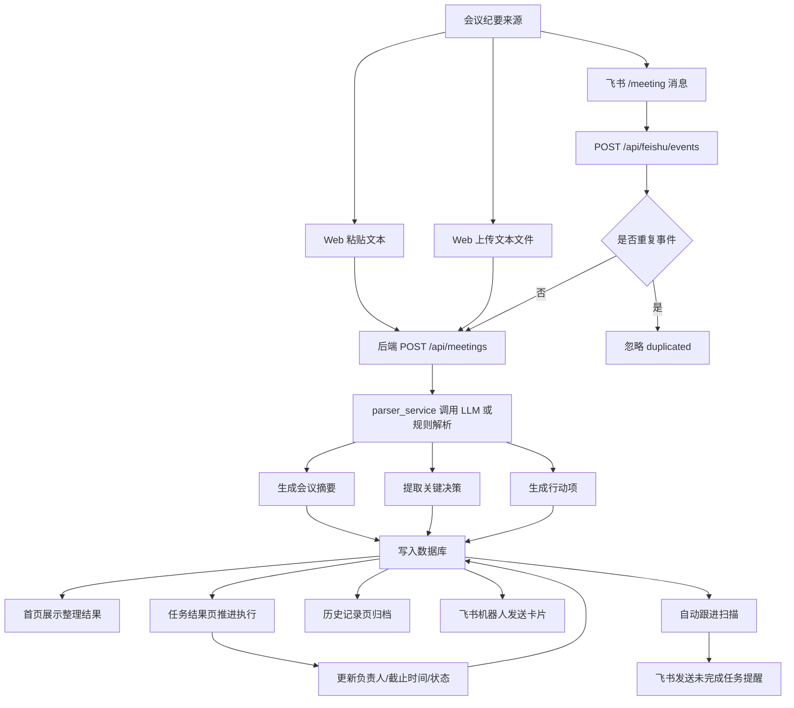
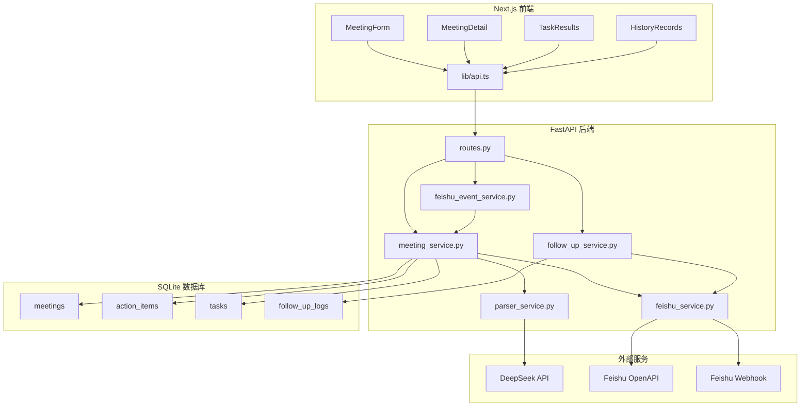

# ActionBridge

ActionBridge 是一个“会议纪要到执行闭环”的办公协作 Agent MVP。它可以把会议文本解析成结构化摘要、关键决策和行动项，并通过 Web 工作台、任务看板、历史归档、飞书机器人通知和自动跟进提醒，持续推进会议后的执行过程。

## 项目定位

这个项目不是单纯的 AI 聊天 Demo，而是面向研发、产品、测试、运营等团队的会议执行工具：

- 降低会议后手动整理纪要、拆任务和跟进状态的成本。
- 将行动项沉淀到系统中，统一管理负责人、截止时间和任务状态。
- 通过飞书机器人接收会议纪要、发布整理结果和发送跟进提醒。
- 通过任务结果页和历史记录页形成可追踪、可回溯的执行闭环。

## 核心功能

- 会议纪要输入：支持粘贴文本，也支持上传 `.txt`、`.md`、`.vtt`、`.srt` 文本文件。
- LLM 解析：调用 DeepSeek/OpenAI-compatible API 生成摘要、决策和行动项。
- 规则兜底：未配置 LLM 或调用失败时，使用规则解析保证本地演示可用。
- 行动项管理：支持编辑负责人、截止日期、截止时间和任务状态。
- 任务结果页：按会议分组展示任务，支持状态筛选、搜索、进度条和风险优先。
- 历史记录页：展示会议归档、整体执行情况和完成率环形图。
- 飞书通知：支持 Webhook 机器人，也支持自建应用机器人发送卡片到指定群。
- 飞书事件接入：支持在飞书中发送 `/meeting` 命令自动创建会议。
- 自动跟进：支持扫描未完成任务，并发送飞书跟进提醒。
- 幂等去重：对飞书事件的 `event_id/message_id` 做进程内去重，避免飞书重试导致重复创建。

## 功能流程



## 页面说明

```text
/                    会议处理工作台
/meetings/[id]       会议详情与行动项编辑
/tasks               任务结果页 / 执行看板
/history             历史记录页 / 归档统计
```

- 会议处理工作台：输入会议标题和会议记录，生成摘要、决策和行动项。
- 会议详情页：查看完整会议结果，编辑行动项负责人、截止时间和状态。
- 任务结果页：按会议分组管理所有行动项，判断每个会议/项目的执行进度。
- 历史记录页：沉淀会议归档，展示整体执行情况、完成率和风险数量。

## 技术架构



## 代码结构

```text
ActionBridge/
  backend/
    app/
      api/
        routes.py                    API 路由入口
      core/
        config.py                    环境变量配置
        time.py                      时间工具
      db/
        session.py                   数据库连接
        base.py                      模型注册
        migrations.py                SQLite 轻量迁移
      models/
        meeting.py                   会议模型
        action_item.py               行动项模型
        task.py                      后台任务模型
        follow_up_log.py             跟进日志模型
      schemas/
        meeting.py                   会议请求/响应结构
        action_item.py               行动项更新结构
        task_result.py               任务结果结构
      services/
        parser_service.py            LLM/规则解析会议纪要
        meeting_service.py           会议、行动项、飞书发送业务逻辑
        feishu_service.py            飞书卡片生成与发送
        feishu_event_service.py      飞书消息事件解析与去重
        follow_up_service.py         未完成任务扫描与提醒
    tests/                           后端自动化测试

  frontend/
    app/
      page.tsx                       首页会议处理
      tasks/page.tsx                 任务结果页
      history/page.tsx               历史记录页
      meetings/[id]/page.tsx         会议详情页
      layout.tsx                     全局布局入口
    components/
      AppShell.tsx                   左侧导航 + 顶部导航
      MeetingForm.tsx                会议输入与文件上传
      MeetingDetail.tsx              会议详情与行动项编辑
      TaskResults.tsx                任务结果页交互
      HistoryRecords.tsx             历史记录页交互
    lib/
      api.ts                         前端 API 请求
      types.ts                       TypeScript 类型
    styles/
      layout.css                     框架导航样式
      workspace.css                  首页工作台样式
      tasks.css                      任务结果页样式
      history.css                    历史记录页样式
      detail.css                     会议详情页样式
```

## 后端 API

```text
POST  /api/meetings                    创建会议并解析纪要
GET   /api/meetings                    获取历史会议列表
GET   /api/meetings/{meeting_id}       获取会议详情
GET   /api/action-items                获取全部行动项
PATCH /api/action-items/{id}           更新行动项负责人、截止时间、状态
POST  /api/meetings/{id}/send-feishu   发送飞书会议摘要
POST  /api/meetings/{id}/follow-up     发送当前会议跟进提醒
POST  /api/follow-ups/run              批量扫描未完成任务并提醒
POST  /api/feishu/events               飞书消息事件入口
POST  /api/feishu/card-callback        预留飞书卡片回调入口
```

## 飞书机器人使用

### 1. 事件订阅地址

本地开发需要先用 ngrok、cpolar 等工具把后端暴露到公网。

飞书事件订阅 Request URL：

```text
https://你的公网域名/api/feishu/events
```

飞书第一次校验时会发送 `challenge`，后端会原样返回。

### 2. 群聊或私聊发送会议纪要

```text
/meeting 官网改版上线协调会

本次会议确认官网改版将按计划在本周五上线，但移动端仍有几个体验问题需要修复。
前端同学需要在明天下午六点前修复移动端导航栏错位问题。
设计同学需要在周三下午三点前补齐首页 banner 的移动端切图。
测试同学需要在周四上午完成核心路径回归测试。
产品经理需要在周三下班前确认上线公告文案，并同步给销售和客服团队。
运营同学需要在周五上午检查官网埋点是否正常上报。
```

处理结果：

- 后端创建会议记录。
- LLM 解析摘要、决策和行动项。
- Web 后台 `/tasks` 和 `/history` 自动出现数据。
- 飞书机器人把会议摘要卡片发送到配置的默认群。

### 3. 飞书发送方式

系统优先使用自建应用机器人发送卡片：

```env
FEISHU_APP_ID=cli_xxx
FEISHU_APP_SECRET=your_feishu_app_secret
FEISHU_DEFAULT_CHAT_ID=oc_xxx
```

如果没有配置自建应用机器人，则回退到 Webhook 机器人：

```env
FEISHU_WEBHOOK_URL=https://open.feishu.cn/open-apis/bot/v2/hook/your-webhook-id
```

## 环境变量

在项目根目录创建 `.env`，可参考 `.env.example`。

```env
DEEPSEEK_API_KEY=your_deepseek_api_key
DEEPSEEK_MODEL=deepseek-chat
DEEPSEEK_BASE_URL=https://api.deepseek.com
ACTIONBRIDGE_PARSER_PROVIDER=deepseek

FEISHU_WEBHOOK_URL=https://open.feishu.cn/open-apis/bot/v2/hook/your-webhook-id
FEISHU_APP_ID=cli_xxx
FEISHU_APP_SECRET=your_feishu_app_secret
FEISHU_DEFAULT_CHAT_ID=oc_xxx

ACTIONBRIDGE_AUTO_FOLLOW_UP_ENABLED=false
ACTIONBRIDGE_AUTO_FOLLOW_UP_HOUR=10
ACTIONBRIDGE_AUTO_FOLLOW_UP_MINUTE=0
ACTIONBRIDGE_AUTO_FOLLOW_UP_POLL_SECONDS=30
```

注意：`.env` 包含密钥，不能提交到 GitHub。

## 启动后端

```bash
cd backend
pip install -r requirements.txt
uvicorn app.main:app --reload
```

后端地址：

```text
http://localhost:8000
```

Swagger 文档：

```text
http://localhost:8000/docs
```

## 启动前端

```bash
cd frontend
npm install
npm run dev
```

前端地址：

```text
http://localhost:3000
```

## 测试

后端测试：

```bash
python -m pytest backend/tests
```

前端构建：

```bash
cd frontend
npm run build
```

当前测试覆盖：

- 会议创建和详情查询
- LLM/规则解析兜底
- 行动项更新
- 任务结果页 API
- 历史记录统计
- 截止日期与到期风险判断
- 飞书卡片 payload
- 飞书事件接入
- 飞书事件幂等去重
- 自动跟进扫描

## 演示流程

1. 启动后端和前端。
2. 打开 `http://localhost:3000`，粘贴会议纪要或上传文本文件。
3. 点击“AI 生成会议纪要”，查看右侧整理结果。
4. 进入会议详情页，编辑行动项负责人、截止日期、截止时间和状态。
5. 进入 `/tasks`，查看按会议分组的任务执行看板。
6. 修改任务状态，例如从“待处理”改为“进行中”或“已完成”。
7. 进入 `/history`，查看会议归档、整体执行情况和完成率。
8. 在飞书中发送 `/meeting` 消息，验证机器人自动创建会议并发布卡片。
9. 运行自动跟进或手动触发跟进提醒，验证未完成任务提醒。

## 当前能力总结

- 已实现会议纪要结构化解析。
- 已实现行动项负责人、截止日期、截止时间和状态管理。
- 已实现任务结果页和历史记录页。
- 已实现飞书 Webhook 和自建应用机器人发送卡片。
- 已实现飞书 `/meeting` 消息事件接入。
- 已实现飞书事件去重，降低重复回调导致的重复发送。
- 已实现自动扫描未完成任务和飞书跟进提醒。

## 后续规划

- 增加飞书指令 `/tasks`，直接在飞书查看当前未完成任务。
- 增加飞书指令 `/done 任务ID`，直接在飞书标记任务完成。
- 将事件去重从进程内存升级为数据库级幂等表。
- 从 SQLite 升级到 PostgreSQL。
- 引入任务队列，将 LLM 解析和飞书发送异步化。
- 引入 Memory，记录团队成员、项目别名和历史任务偏好。
- 接入 MCP，让 Agent 读取更多办公系统上下文。

## 简历描述参考

ActionBridge 是一个会议执行闭环 Agent MVP，基于 FastAPI、Next.js、SQLite、DeepSeek API 和飞书机器人集成，实现会议纪要结构化解析、行动项生成、任务状态跟进、历史归档、飞书消息接入和自动提醒，帮助团队降低会议后整理与执行跟进成本。
